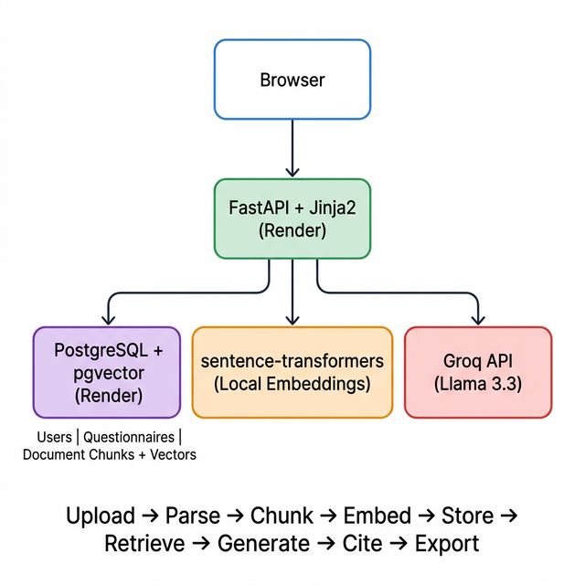

# Structured Questionnaire Answering Tool

**Live**: [https://almabase-ycls.onrender.com/](https://almabase-ycls.onrender.com/)  
**Repository**: [https://github.com/pranjalkhare2004/almabase](https://github.com/pranjalkhare2004/almabase)

---

## Industry & Company

**Industry**: Compliance & Legal Tech  
**Company**: **AlmaBase Compliance Solutions** — a fictional SaaS startup that automates structured compliance questionnaires using AI-powered document grounding. Organizations upload their internal policies and security documentation, then AlmaBase answers vendor assessment questionnaires with verifiable citations.

---

## System Overview

This project allows users to:
1. **Register and log in** via JWT-based authentication
2. **Upload a questionnaire** (PDF/TXT) — parsed into individual questions
3. **Upload reference documents** (PDF/TXT) — chunked, embedded, and stored in PostgreSQL with pgvector
4. **Generate answers** using a RAG pipeline — each question retrieves relevant chunks via cosine similarity, and Llama 3.3 (via Groq) generates grounded answers
5. **Review and edit** answers before finalizing
6. **Export** the completed questionnaire as a structured DOCX file

Unsupported questions (no relevant chunks found) return **"Not found in references."** with no citations — enforced deterministically.

---

## Architecture



```text
User (Browser)
      ↓
FastAPI + Jinja2 (Render Web Service)
      ↓                    ↓                    ↓
PostgreSQL + pgvector    sentence-transformers   Groq API
(Render Managed DB)      (Local Embeddings)     (Llama 3.3)
      ↓
Users | Questionnaires | Document Chunks + Vectors
```

### RAG Pipeline Flow

```text
Question → Embed → Retrieve top 5 (pgvector cosine)
  → Fallback gate (best < 0.30 → skip LLM)
  → Dynamic margin filter (best - 0.10)
  → Select top 3 chunks → LLM generates answer only
  → System attaches citations from chunk metadata
```

---

## Features Implemented

- ✅ User Authentication (JWT, httponly cookies, bcrypt)
- ✅ Upload questionnaire documents (PDF/TXT)
- ✅ Upload and store reference documents (PDF/TXT)
- ✅ Automatic questionnaire parsing into ordered questions
- ✅ RAG-based answer generation with deterministic citations
- ✅ Fallback: "Not found in references." for unsupported questions
- ✅ Review and edit answers before export
- ✅ Export results as formatted DOCX
- ✅ Health check endpoint (`/health`)
- ✅ Persistent vector storage (pgvector — survives server restarts)

---

## Tech Stack

| Component | Technology |
|-----------|-----------|
| **Backend** | FastAPI + Jinja2 templates |
| **Database** | PostgreSQL with pgvector |
| **Embeddings** | sentence-transformers (`all-MiniLM-L6-v2`, local) |
| **LLM** | Groq API (Llama 3.3 70B Versatile) |
| **Auth** | JWT (python-jose) + bcrypt |
| **Export** | python-docx |
| **Deployment** | Render (Web Service + Managed PostgreSQL) |
| **Containerization** | Docker |

---

## Project Structure

```text
almabase/
├── app/
│   ├── main.py              # FastAPI app, routes, startup
│   ├── auth.py              # JWT authentication, login/register
│   ├── database.py          # PostgreSQL + pgvector setup
│   ├── models.py            # SQLAlchemy models (User, Questionnaire, Question, DocumentChunk)
│   ├── schemas.py           # Pydantic validation schemas
│   ├── utils.py             # Text extraction, question parsing
│   ├── rag/
│   │   ├── __init__.py      # Package exports
│   │   ├── chunking.py      # Paragraph-aware chunking (400-700 tokens)
│   │   ├── embedding.py     # Singleton sentence-transformers model
│   │   ├── retrieval.py     # pgvector cosine similarity search
│   │   ├── generation.py    # Groq LLM (answer text only)
│   │   ├── citation.py      # Deterministic citation builder
│   │   └── orchestrator.py  # Pipeline: retrieve → gate → generate → cite
│   ├── templates/           # Jinja2 HTML templates
│   └── static/              # CSS styles
├── tests/
│   └── test_rag.py          # Embedding, chunking, citation tests
├── test_data/               # Sample questionnaire + reference docs
├── .env.example
├── Dockerfile
├── docker-compose.yml       # Local development (app + pgvector DB)
├── render.yaml              # Render Blueprint (production)
├── requirements.txt
├── architecture.png
└── README.md
```

---

## Assumptions

- Questions are separated by newline numbering (1. / 1) / Q1.)
- Reference documents contain the answers — the LLM uses only provided context
- `all-MiniLM-L6-v2` embeddings (384 dimensions) for local embedding
- Dynamic threshold: absolute floor 0.30, margin 0.10 from best score
- Each answer is generated independently (no cross-question context)

---

## Trade-offs

| Decision | Rationale |
|----------|-----------|
| Flat vector index | Acceptable for demo scale (<1000 chunks); IVFFlat recommended for production |
| Synchronous API calls | Simpler architecture; async workers not needed for internship demo |
| Local embeddings | No API cost; sentence-transformers runs on CPU |
| Cookie-based JWT | Simpler than header-based auth for server-rendered templates |
| Dynamic margin threshold | Adapts to document quality; avoids rigid cutoff killing recall |
| No background processing | Keeps deployment simple; generation happens in request cycle |

---

## RAG Evaluation Summary

| Metric | Value | Target |
|--------|-------|--------|
| **Retrieval Recall** | 100% (10/10) | ≥ 90% |
| **Citation Precision** | 100% (9/9) | ≥ 95% |
| **Fallback Accuracy** | 66.7% (2/3) | 100% |
| **Hallucinated Citations** | 0 | 0 |
| **Overall Maturity** | 8.0/10 | — |

> Fallback accuracy is 66.7% because one "unsupported" question (cryptographic key management) is borderline — the reference documents mention key rotation via AWS KMS. Fully unrelated questions correctly trigger fallback.

---

## How to Run Locally

### Prerequisites
- Python 3.10+
- Docker Desktop (for PostgreSQL)
- Groq API key ([console.groq.com](https://console.groq.com))

### Setup

```bash
# Clone
git clone https://github.com/pranjalkhare2004/almabase.git
cd almabase

# Start PostgreSQL with pgvector
docker-compose up -d

# Install dependencies
pip install -r requirements.txt

# Configure environment
cp .env.example .env
# Add your GROQ_API_KEY and SECRET_KEY to .env
# Uncomment DATABASE_URL for local dev

# Run
uvicorn app.main:app --reload --port 8000
```

Visit `http://localhost:8000`

### Run Tests

```bash
python tests/test_rag.py
```

---

## Deployment (Render)

### Option A — Blueprint (recommended)
1. Fork this repo to your GitHub
2. Go to [Render Dashboard](https://dashboard.render.com) → **New** → **Blueprint**
3. Connect your repo — Render reads `render.yaml` automatically
4. Set `GROQ_API_KEY` in the dashboard
5. Deploy

### Option B — Manual
1. Create a **PostgreSQL** database on Render
2. Create a **Web Service** → Docker runtime → connect your repo
3. Set environment variables:
   - `DATABASE_URL` — from Render PostgreSQL dashboard
   - `GROQ_API_KEY` — your Groq API key
   - `SECRET_KEY` — any random string
4. Deploy

### Environment Variables

| Variable | Required | Source |
|----------|----------|--------|
| `DATABASE_URL` | Yes | Render PostgreSQL (auto-injected via Blueprint) |
| `GROQ_API_KEY` | Yes | [console.groq.com](https://console.groq.com) |
| `SECRET_KEY` | Yes | Auto-generated by Render Blueprint |

---

## What I Would Improve

- **Hybrid retrieval**: Combine vector similarity with PostgreSQL full-text search (keyword boost)
- **Confidence scores**: Show similarity score alongside each answer
- **Evidence snippets**: Display the exact chunks used to generate each answer
- **Version history**: Track answer edits over time
- **Coverage summary**: Show overall completion percentage and unsupported question count
- **Async generation**: Use background tasks for large questionnaires
- **IVFFlat index**: Switch from flat to IVFFlat for datasets with >10K chunks
